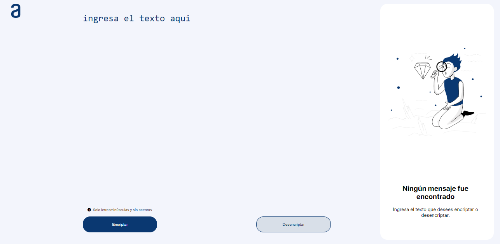

# Encriptador de Texto

Este es un proyecto de encriptador de texto desarrollado con HTML, CSS y JavaScript. El objetivo del encriptador es permitir a los usuarios cifrar y descifrar mensajes de texto de manera simple y eficiente.

## Características

- **Encriptación y Desencriptación**: Introduce un texto en el área correspondiente y elige entre encriptar o desencriptar el mensaje.
- **Copia Fácil**: Copia el texto encriptado o desencriptado con un solo clic.
- **Interfaz Intuitiva**: Diseño claro y fácil de usar con soporte para dispositivos móviles.
- **Soporte Responsivo**: La aplicación es completamente responsiva, adaptándose a diferentes tamaños de pantalla, incluidos tabletas y dispositivos móviles.

## Tecnologías Utilizadas

- **HTML5**: Estructura del proyecto.
- **CSS3**: Estilización y diseño responsivo.
- **JavaScript**: Lógica de encriptación y desencriptación.

## Uso
- Escribe o pega el texto que deseas encriptar en el área de texto de entrada.
- Haz clic en el botón "Encriptar" para convertir el texto a su forma cifrada.
- Haz clic en "Desencriptar" para revertir el proceso y obtener el texto original.
- Utiliza el botón "Copiar" para copiar el texto cifrado o descifrado al portapapeles.
